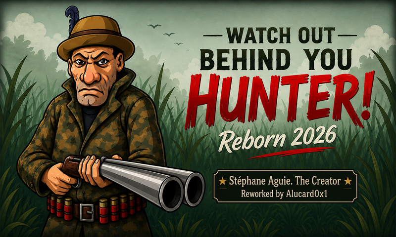

# Hunter-Gayatek

Hunter-Gayatek is a desktop HTML canvas survival game converted from the original Java game assets. The player controls a hunter fighting Gayatek vampires across multiple map levels.



## Play

Open `index.html` in a desktop browser.

The game is built as a static HTML game, so no installation step is required.

## Gameplay

The hunter must survive each level, shoot enemies, collect bullets, and reach the map exit. Each new level resets the hunter back to 7 lives. If the hunter is caught, one life is lost and the current level restarts without restoring the lost life.

The game uses several Gayatek enemy behaviors:

- Normal Gayatek chase the hunter after waking from bushes.
- Brute Gayatek are 2x larger and can throw the hunter through the air toward another dangerous area.
- Lasso Gayatek can pull or disable the hunter from range.
- Executor Gayatek can appear after a bind lasso and rush in for the catch.

## Controls

| Input | Action |
| --- | --- |
| Right click | Move hunter to target point |
| Left click | Shoot toward cursor |
| `C` | Activate chakram shield |
| `V` | Activate 360 rapid shot when available |

## Player Abilities

### Shotgun

The hunter shoots toward the mouse cursor with left click. Ammo is limited, and bullets can be collected during gameplay.

### Chakram Shield

Press `C` to activate the chakram blade shield around the hunter. The chakram has a cooldown indicator in the bottom-left HUD.

### 360 Rapid Shot

Press `V` to activate a short 360-degree rapid shooting ability. It is available once per level if the hunter still has the full 7 lives for that level.

## Enemy Types

### Normal Gayatek

Standard enemy that wakes from bushes and chases or flanks the hunter.

### Brute Gayatek

Large 2x Gayatek that runs quickly. When it catches the hunter, it throws the hunter in a parabolic arc toward another area containing enemies instead of directly executing him.

### Lasso Gayatek

Ranged Gayatek that uses a lasso sprite animation. There are two lasso effects:

- Slow lasso: hunter can still move, but movement speed is reduced.
- Bind lasso: hunter cannot move briefly and an executor Gayatek appears.

### Executor Gayatek

Fast Gayatek spawned by the bind lasso. It immediately rushes toward the hunter.

## Levels

The game uses level map assets named:

- `newmap_level1.png`
- `newmap_level2.png`
- `newmap_level3.png`
- `newmap_level4.png`
- `newmap_level5.png`

Enemy count and enemy variety increase as levels progress.

## Project Structure

```text
.
├── index.html
├── style.css
├── game.js
├── js/
│   ├── config.js
│   ├── state.js
│   ├── utils.js
│   ├── assets-audio.js
│   ├── level.js
│   ├── systems.js
│   ├── render.js
│   ├── input.js
│   └── main.js
├── assets/
│   ├── font/
│   ├── gfx/
│   └── mfx/
```

## Code Overview

- `js/config.js`: canvas constants, asset lists, and sprite sheet metadata
- `js/state.js`: global game state
- `js/assets-audio.js`: image and audio loading
- `js/level.js`: level setup, enemy spawning, win/lose flow
- `js/systems.js`: gameplay updates, movement, attacks, enemy AI, special abilities
- `js/render.js`: canvas drawing and HUD rendering
- `js/input.js`: keyboard and mouse controls
- `js/main.js`: startup and game loop

## Assets

The game keeps the original visual/audio assets in `assets/`, with additional generated or adjusted sprites such as:

- `chakram.png`
- `lasso.png`
- `newstart_button.png`
- `newbush_*.png`
- `newmap_level*.png`

## Notes

This project is designed for desktop play. Mobile joystick overlays from the original game are not used in the HTML version.

## Credits

- Stéphane Aguie 2002 as The Creator
- Reworked by Alucard0x1
